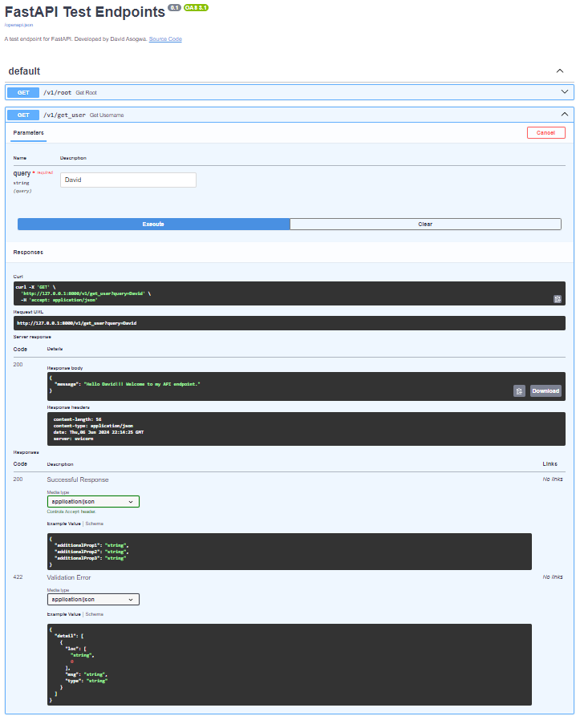

# FastAPI Test Enpoint
A FastAPI endpoint sample configuration using the FastAPI library with uvicorn. Performs no specific function but can be implemented for any use case.

# Local Setup
### Windows
```
git clone https://github.com/Merci93/FastAPI

cd FastAPI

python -m venv env

env/Scripts/activate

python.exe -m pip install --upgrade pip

pip install -r requirements.txt

uvicorn src.main:app --reload
```

### Linux / Mac
```
git clone https://github.com/Merci93/FastAPI

cd FastAPI

python3 -m venv env

source env/bin/activate

pip install --upgrade pip

pip install -r requirements.txt

uvicorn src.main:app --reload
```


## Running test cases
#### Windows
```
python -m venv testenv

testenv/Scripts/activate

python.exe -m pip install --upgrade pip

pip install -r test/test_requirements.txt

pytest
```

#### Linux/Mac
```
python3 -m venv testenv

source testenv/bin/activate

pip install --upgrade pip

pip install -r test/test_requirements.txt

pytest
```

# Fast API Enpoint UI

